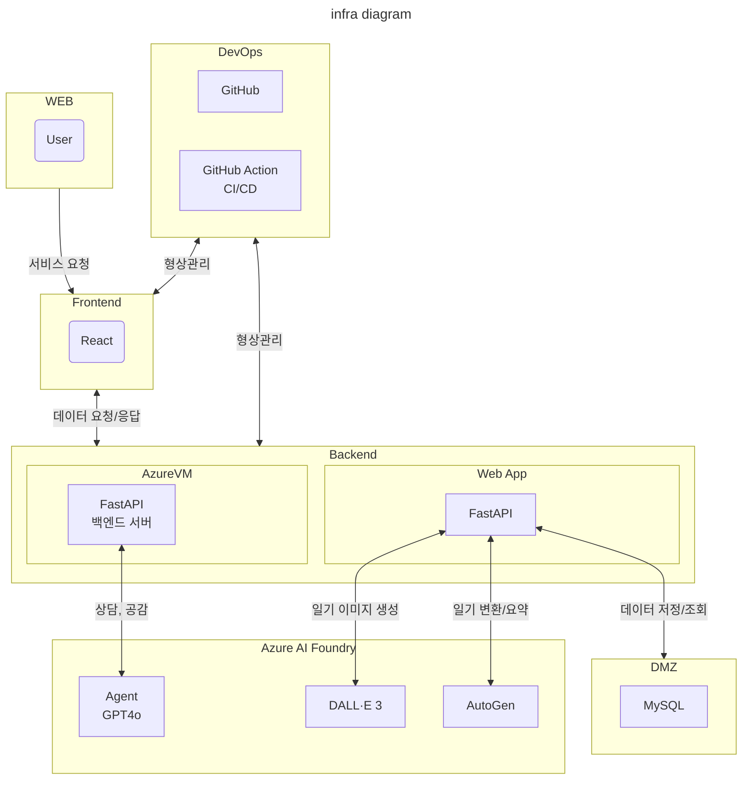

```mermaid
---
title: infra diagram
---

graph TD
    subgraph WEB [WEB]
        User(User)
    end
    subgraph Frontend [Frontend]
        frontweb(React)
    end

    subgraph Backend [Backend]
        subgraph webapp["Web App"]
            API1[FastAPI]
        end

        subgraph AzureVM[AzureVM]
            API2[FastAPI<br>백엔드 서버]

        end
    end
    subgraph DMZ [DMZ]
        MySQL[MySQL]
    end

    subgraph AI [Azure AI Foundry]
        Agent[Agent<br>GPT4o]
        Dalle3[DALL·E 3]
        AutoGen[AutoGen]
    end

    subgraph DevOps
        GitHub[GitHub]
        GitHubActions[GitHub Action<br>CI/CD]
    end
    Frontend <--데이터 요청/응답-->Backend
    WEB --서비스 요청--> Frontend
    DevOps  <--형상관리-->Backend
    DevOps  <--형상관리-->Frontend
    API2 <--상담, 공감--> Agent
    API1 <--일기 이미지 생성--> Dalle3
    API1 <--일기 변환/요약--> AutoGen
    API1 <--데이터 저정/조회--> DMZ

```
